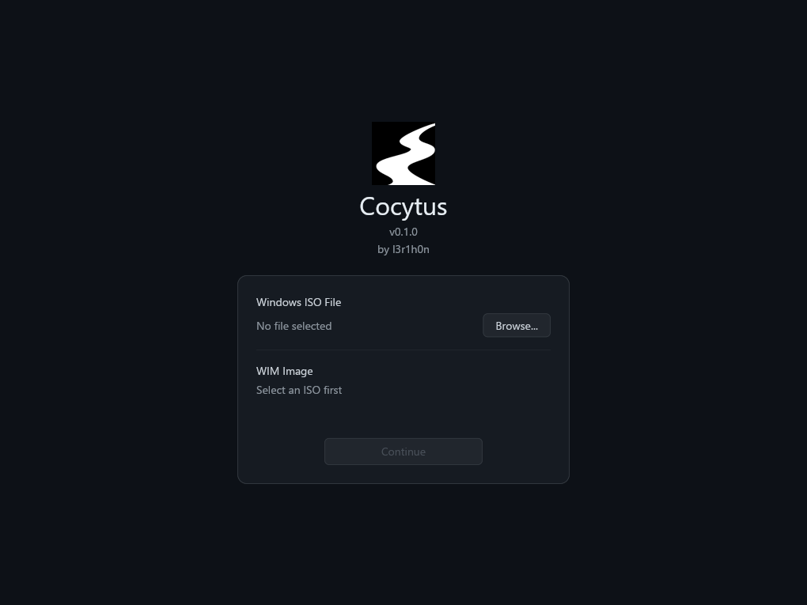
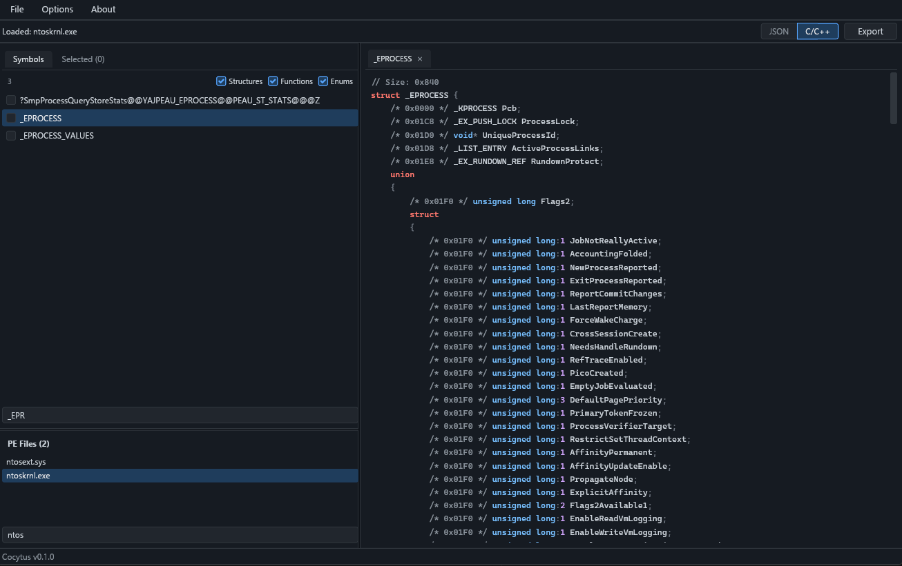

<div align="center">

<h1>Cocytus</h1>


</div>

## Description

A tool for Windows symbols parsing, allowing you to open arbitrary windows ISO file, parse it's PE files symbols and extract them in format you need (JSON or C header file).

## Usage

Below is a simple usage example - extracting `_EPROCESS` offsets directly from installation media. No need to install windows or manually unpack `.wim` archive - just load:

<p align="center">

</p>

Search for `ntoskrnl.exe`, load it's pdb file (by just right clicking on it) and search for `_EPROCESS` symbol:

<p align="center">

</p>

Select any needed symbol using checkbox in Symbols panel and click on `Export` button to export all selected symbols in `.json` or `.h` formats. You can also extract `.pdb` or PE files directly - just right-click on file in `PE Files` panel.

## Getting Cocytus

### Download

Cocytus is currently a windows only app, but this could change in a future. For now, you can download stable release windows binary from [Github Release](https://github.com/I3r1h0n/Cocytus/releases) page.

### Build from source

You can also build it from source! All you need is a latest rust build tools and Inno-Setup compiler for installer build. You can find Rust standalone windows installers [here](https://forge.rust-lang.org/infra/other-installation-methods.html#standalone-installers) and Inno-Setup installer [here](https://jrsoftware.org/isdl.php). 

Then, just clone the main branch and build:
```shell
git clone https://github.com/I3r1h0n/Cocytus
cd Cocytus
cargo build --release
iscc installer.iss
```

After build finish, you can find `Cocytus` binary in `\target\release`, and installer in `\installer` folders.

### Getting ISO files

You can use any ISO file you want (just make shure that it't windows ISO), but if you want to get any specific build/version ISO file, you can use [UUP Dump](https://uupdump.net/) to get one.

## Project structure

The overall project structure is simple:
```bash
/assets # The app logos
/src
    /extractors
        /pdb # PDB file reader, based on `pdb` crate
        iso.rs # Simple iso reader (mount/unmount with Powershell)
        wim.rs # wimlib FFI bindings and callbacks
    /gui
        /theme # All the colors and syntax highlight
        /views # Main and setup view
        /widgets # All the buttons, searchbars and etc
        app.rs # GUI Entrypoint
        types.rs # All GUI types
        update.rs # Message dispatcher and it's helpers
    /utils # Helper utils
        config.rs # Reads and setups app configuration 
        pdb_loader.rs # Loads and caches symbols
        pe_info.rs # PE information extractor
    error.rs # Custom error
    main.rs # Entrypoint
/wimlib # .wim parser library
build.rs # Build script
installer.iss # Inno-Setup script
```

## Contribution

If you have any idea on how to improve this project, and want to participate in it's development - open a PR with non-empty PR message, and I will review it ASAP.

Or, if you want to report a bug, have a good idea on what should I implement next or need some help with tool - open an Issue on GitHub. 

## Creds
prod by _I3r1h0n_.
